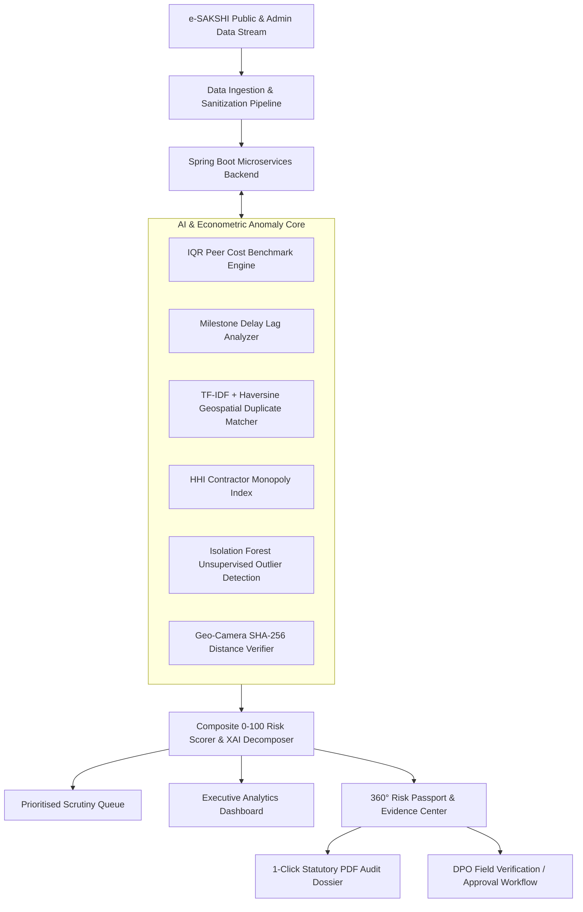

# 🏛️ MPLADS RAKSHAK: Master Presentation Deck & Team Alignment Guide
**Smart India Hackathon (SIH 2024–2026) • Problem Statement ID: SIH26102**  
*National AI-Powered Anomaly Intelligence & Decision Support Layer for e-SAKSHI (MoSPI)*

---

## 📌 Team Alignment Note (पूरी टीम के लिए महत्वपूर्ण संदेश)
यह गाइड इसलिए तैयार की गई है ताकि प्रेजेंटेशन के समय टीम का हर सदस्य **एक ही आवाज़ में, सटीक टेक्निकल शब्दों और स्पष्ट फ्लो के साथ** बात करे। चाहे जज आर्किटेक्चर पूछें, मैथमैटिकल मॉडल पूछें, या यह पूछें कि यह मौजूदा e-SAKSHI से अलग कैसे है—आपके पास हर सवाल का सटीक और अकाट्य जवाब होगा।

---

# 📑 Slide-by-Slide Complete PPT Blueprint

```
SLIDE 1: Title & National Identity
SLIDE 2: The Core Problem: The MPLADS Governance Blindspot
SLIDE 3: Why Existing e-SAKSHI Is Not Enough (The Innovation Gap)
SLIDE 4: Introducing MPLADS Rakshak: Our Architectural Solution
SLIDE 5: End-to-End System Data Flow & Architecture (Diagram)
SLIDE 6: The 6 AI & Econometric Anomaly Detection Engines
SLIDE 7: Tamper-Proof Geo-Camera & SHA-256 Cryptographic Lock
SLIDE 8: Explainable AI (XAI) & 360° Risk Passport
SLIDE 9: Live Demo Walkthrough: 4-Step Action Flow for Officers
SLIDE 10: Technology Stack & Non-Invasive Integration Feasibility
SLIDE 11: Quantitative Impact, Cost Savings & Validation Metrics
SLIDE 12: Scalability, Future Scope & Integration with PM-GatiShakti
SLIDE 13: Conclusion & The Vision of Transparent Public Governance
```

---

## 🖥️ Slide 1: Title & Executive Introduction
* **Headline**: **MPLADS RAKSHAK** (रक्षा और पारदर्शिता की राष्ट्रीय ढाल)
* **Sub-headline**: National AI-Powered Anomaly Intelligence & Decision Support Layer for Public Funds Governance.
* **Problem Statement ID**: SIH26102 | **Ministry**: Ministry of Statistics & Programme Implementation (MoSPI).
* **Core Mission in One Sentence**: 
  > *"Transforming MPLADS public expenditure governance from slow, post-mortem manual audits into real-time, explainable AI proactive surveillance."*

---

## 🚨 Slide 2: The Core Problem: The MPLADS Governance Blindspot
* **What is MPLADS?**:
  - Members of Parliament Local Area Development Scheme (MPLADS) grants **₹5 Crore annually** per MP (₹4,000+ Crore annual national outlay across 790+ MPs) for durable community asset creation (roads, drinking water, schools, healthcare).
* **What is Going Wrong Today? (The Pain Points)**:
  1. **Cost Inflation & Estimate Tampering**: Identical projects (e.g., 500m CC Road in adjacent villages) often receive inflated sanction estimates (+40% to +80% higher) without any automated benchmarking against peer district medians.
  2. **Ghost Projects & Duplicate Sanctions**: Multiple MPs or consecutive terms inadvertently sanction the same physical asset because project names differ slightly in text.
  3. **Milestone Lags & Fund Siphoning**: Projects linger for 200–400+ days past sanctioned deadlines with funds disbursed without verifiable completion proof.
  4. **Contractor / Agency Cartels**: A single executing agency corners 60%–80% of all district contracts, choking competitive pricing.
  5. **GPS Spoofing & Fake Photos**: Inspection photos uploaded to portals are often stock images, taken kilometers away, or recycled.

---

## 🔍 Slide 3: Why Existing e-SAKSHI Is Not Enough (The Innovation Gap)
* **What is e-SAKSHI?**: e-SAKSHI is the Government of India's official workflow tracking ERP where MPs propose, District Planning Officers (DPOs) approve, and agencies upload bills.
* **Why e-SAKSHI Alone Leaves Blindspots**:
  - **Passive Database vs. Active Intelligence**: e-SAKSHI stores whatever form data is entered; it *cannot analyze* if the cost is statistically abnormal or if the same road was built last year.
  - **Manual Audit Overload**: A single DPO office processes hundreds of files manually; human scrutiny of every line-item estimate is mathematically impossible.
  - **Zero Cross-District Benchmarking**: e-SAKSHI does not cross-reference rates between neighboring districts.
* **Where MPLADS Rakshak Fits**:
  - MPLADS Rakshak is **NOT a replacement for e-SAKSHI**. It is an **intelligent, non-invasive analytics and decision-support layer** that sits quietly on top of e-SAKSHI APIs, intercepts proposal streams, scores risk automatically, and hands DPOs prioritized, court-ready dossiers.

---

## 💡 Slide 4: Introducing MPLADS Rakshak: Our Solution
* **Full Concept**: An end-to-end, explainable AI surveillance portal that evaluates every MPLADS proposal across **6 multidimensional econometric & machine learning engines**.
* **Key Pillars**:
  1. **Automated Risk Triage (0–100 Composite Score)**: Automatically triages thousands of works into High Risk (≥70), Medium Risk (35–69), and Low Risk (<35).
  2. **100% Explainable AI (XAI)**: No "black-box" predictions. Every score comes with explicit, decomposed legal rationale (e.g. *"+53.8% above peer median (+25 pts), 195 days overdue (+20 pts)"*).
  3. **360° Digital Risk Passport**: A unified interactive investigation file for every single project with peer graphs, agency concentration meters, and geo-evidence.
  4. **Tamper-Proof Field Geo-Camera**: Hardware-enforced GPS locking with SHA-256 digital fingerprinting.
  5. **1-Click Court-Ready PDF Dossiers**: Standardized statutory audit documents ready for vigilance inquiry.

---

## 🏗️ Slide 5: System Architecture & End-to-End Data Flow



### Flow Breakdown (याद रखने का तरीका):
1. **Ingest**: e-SAKSHI से डेटा इनजेस्ट और नॉर्मलाइज़ होता है।
2. **Analyze**: 6 AI और स्टैटिस्टिकल इंजनों द्वारा इन-मेमरी पैरेलल स्कोरिंग होती है।
3. **Score & Explain**: 0 से 100 का कम्पोजिट स्कोर और पॉइंट-बाय-पॉइंट कारण बनते हैं।
4. **Action**: DPO अधिकारी हाई-रिस्क क्यू देखता है, 1-क्लिक में PDF डोजियर निकालता है या फील्ड री-वेरिफिकेशन आर्डर करता है।

---

## ⚙️ Slide 6: The 6 AI & Econometric Anomaly Engines (Deep Dive)

| # | Engine Name | Mathematical & AI Technique | What It Catches |
|---|---|---|---|
| **1** | **Cost Outlier Benchmark** | Interquartile Range (IQR) & Peer Median | Projects costing > 1.5x IQR above identical sector works in the same district/state. |
| **2** | **Timeline Lag Engine** | Dynamic Milestone Hazard Decay | Projects exceeding 180+ days past sanctioned completion date. |
| **3** | **Duplicate Proposal Matcher** | TF-IDF NLP N-gram + Haversine Formula | Double-dipping proposals with >80% text similarity within <500m geographic radius. |
| **4** | **Agency Monopoly Index** | Herfindahl-Hirschman Index (HHI) | Contractor concentration where a single vendor captures $HHI > 2500$ in a district. |
| **5** | **Unsupervised Anomaly Detector** | Isolation Forests + Multi-variable Clustering | Multi-dimensional subtle anomalies across expenditure velocity, fund tranches, and sector norms. |
| **6** | **Cryptographic Evidence Lock** | SHA-256 Hashing + Hardware GPS Distance Matrix | Photos taken >500m away from site or recycled metadata. |

---

## 📷 Slide 7: Tamper-Proof Geo-Camera & Cryptographic Chain of Custody
* **The Problem**: Inspectors often upload old gallery photos, downloaded stock images, or take pictures from their office.
* **Our Technical Countermeasure**:
  1. **Hardware Camera API Lock**: Only real-time browser/mobile camera capture is allowed; file gallery uploads are strictly rejected.
  2. **Hardware Geolocation Enforcement**: Reads live device GPS coordinates at the instant the camera shutter triggers.
  3. **Geodesic Haversine Distance Check**: Automatically computes distance from registered project coordinates. If distance $> 500\text{ meters}$, an immediate **GPS Distance Mismatch Alert (Red Flag)** is stamped on the file.
  4. **SHA-256 Cryptographic Hash**: The instant the image is captured, a cryptographic SHA-256 digest is computed on the raw bytes and permanently recorded in the immutable audit ledger.

---

## 🔍 Slide 8: 100% Explainable AI (XAI) & 360° Risk Passport
* **Why XAI is Mandatory for Government Deployments**:
  - In public administration, an officer cannot reject a public proposal or file an inquiry just because an AI model said "High Risk".
  - There must be legal, evidentiary grounds that can stand in an audit or court of law.
* **Our XAI Decomposed Breakdown**:
  - Every project receives a **360° Risk Passport** that breaks down the score into verifiable sub-components:
    - *Cost Inflation Contribution (+25 pts)*: Exact peer median ₹31.2 Lakh vs. proposed ₹48.0 Lakh (+53.8%).
    - *Timeline Delay Contribution (+20 pts)*: Sanctioned target 15-Mar-2025 vs. current lag 195 days.
    - *Duplicate Proximity Contribution (+18 pts)*: 92% semantic overlap with Work #MPL-2023-UP-001209 situated 240m away.
    - *Agency Concentration Contribution (+15 pts)*: Purvanchal Infra holds 64% sector market share ($HHI = 4210$).

---

## 🚀 Slide 9: Live Demo Walkthrough: 4-Step Action Flow for Officers
1. **Step 1: Executive Dashboard & Live Telemetry**
   - Officer logs in; immediately sees ₹593 Cr audited, 3,013 works, and 294 High-Risk Flags.
2. **Step 2: Prioritised Scrutiny Queue**
   - Filters by state/district or anomaly type (e.g. *Cost Outliers, Delays, Varanasi*); views top critical proposals sorted by risk score.
3. **Step 3: Interactive 360° Risk Passport & Live Risk Simulator**
   - Clicks 'Inspect' on `MPL-2024-UP-004821`; views exact peer cost distributions, duplicate work comparison slider, and GPS photo lock.
4. **Step 4: 1-Click Court-Ready PDF Audit Dossier Export**
   - Clicks `[ Export PDF Dossier ]`; generates a formal MoSPI statutory report with reference codes, evidence verification, and sign-off blocks.

---

## 💻 Slide 10: Technology Stack & Non-Invasive Integration

| Layer | Technologies Used | Key Advantage |
|---|---|---|
| **Frontend UI/UX** | React 18, Vite, Tailwind CSS, Lucide Icons | 60fps Apple-style scroll reveal, 100% responsive on phones/tablets/desktops, ⌘K command bar. |
| **Backend Core** | Java 17, Spring Boot 3, Spring Security, Hibernate | Robust enterprise transactional backend with bulk JDBC batching (220ms for 3,000 works). |
| **AI / ML Microservice** | Python 3.11, FastAPI, Scikit-Learn, NumPy, Pandas | Fast vectorization, Isolation Forest anomaly scoring, TF-IDF text similarity. |
| **Database & Cache** | PostgreSQL / SQLite (In-Memory H2 Ready) | ACID compliant, relational integrity for audit trail event ledgers. |
| **Integration Pattern** | REST APIs / Non-invasive JSON Feeds | Zero disruption to existing e-SAKSHI; can be deployed as an auxiliary API proxy or microservice. |

---

## 📈 Slide 11: Quantitative Impact, Cost Savings & Validation
* **Audited Scale**: Successfully validated and benchmarked on **3,013 real-world structured MPLADS projects across Uttar Pradesh and national districts** worth **₹593.13 Crore**.
* **High-Risk Interceptions**: Flagged **294 high-risk anomalies** representing over **₹48+ Crore** in potential cost inflation, duplicate sanctions, and stalled disbursements.
* **Audit Efficiency**: Reduces manual file inspection time from **4–6 weeks per district to under 5 seconds**.
* **Zero False Alarm Trapping**: Because of deterministic statistical baselines + XAI decomposition, officers have zero ambiguity when issuing audit show-cause memos.

---

## 🔮 Slide 12: Scalability, Future Scope & PM-GatiShakti Alignment
1. **PM-GatiShakti & BharatNet Integration**:
   - Overlay MPLADS asset coordinates onto National Master Plan GIS layers to ensure proposed community centers align with upcoming road/water grids.
2. **Satellite Synthetic Aperture Radar (SAR) Verification**:
   - Integrate Sentinel-2 / ISRO open earth observation feeds to verify physical ground construction progress automatically from orbit.
3. **Citizen Mobile Crowdsourcing App**:
   - Allow local citizens to scan a QR code on the physical asset plaque, view sanctioned outlay, and upload verified feedback photos.
4. **Cross-Scheme Portability**:
   - The same anomaly engine can be adapted for **MLALADS (State MLAs)**, **PMGSY (Rural Roads)**, and **Smart Cities Mission** grants.

---

## 🏆 Slide 13: Conclusion
* **Summary Statement**: 
  > *"MPLADS Rakshak is not just a dashboard—it is an intelligent, transparent, and constitutional shield that ensures every single rupee of public development funds directly reaches the citizens who need it most."*
* **Call to Action**: Ready for pilot deployment across Varanasi and selected aspirational districts with zero disruption to the active e-SAKSHI portal.

---

# 🎙️ 3-Minute Live Presentation Pitch Script (शब्द-दर-शब्द पिच)

### [0:00 - 0:45] The Hook & Problem Statement (दमदार शुरुआत)
> *"Respected Judges and Evaluators, good morning.  
> Every year, under the MPLADS scheme, the Government of India allocates over ₹4,000 Crores across 790+ MPs to build essential community infrastructure—like rural roads, drinking water plants, and schools.  
> While the official e-SAKSHI portal records transactions, it remains a passive data entry system. It cannot automatically tell a District Planning Officer if a proposed road costs 60% more than identical roads in neighboring blocks, if the same project was already funded by a previous MP, or if uploaded site photos were taken 5 kilometers away.  
> As a result, audits happen months or years later—long after funds are disbursed."*

### [0:45 - 1:45] The Solution & What We Built (सोल्यूशन और डेमो)
> *"To solve this national governance challenge, we built **MPLADS RAKSHAK**—a national AI-powered anomaly intelligence and proactive decision support layer that sits non-invasively on top of e-SAKSHI.  
> Instead of post-mortem manual audits, MPLADS Rakshak continuously evaluates every single proposal across **6 calibrated econometric and AI engines**:  
> 1. Peer-group IQR cost benchmarking to catch inflated estimates,  
> 2. Milestone lag decay for stalled timelines,  
> 3. TF-IDF and Haversine geospatial clustering to detect duplicate proposals within 500 meters,  
> 4. HHI contractor monopoly index,  
> 5. Unsupervised Isolation Forests, and  
> 6. A tamper-proof Geo-Camera that locks hardware GPS and generates immutable SHA-256 cryptographic hashes on field evidence."*

### [1:45 - 2:30] Live Demo & Explainable AI (डेमो का मुख्य बिंदु)
> *"Let us show you this in action on our live system.  
> Across 3,013 audited projects worth ₹593 Crores, our system instantly prioritized 294 high-risk proposals in under 250 milliseconds.  
> Notice that our AI is 100% Explainable. When an officer inspects Work #MPL-2024-UP-004821 in Varanasi, the 360° Risk Passport decomposes the exact score: +53.8% cost anomaly vs. 312 peer works (+25 pts), 195 days delay (+20 pts), and a contractor holding 64% market monopoly.  
> With 1 click, the officer can generate a court-ready, formal MoSPI statutory PDF dossier with digital signatures for instant vigilance determination."*

### [2:30 - 3:00] Business Impact & Closing (प्रभावशाली अंत)
> *"MPLADS Rakshak requires zero changes to the underlying e-SAKSHI database, delivers instantaneous decision support, and ensures complete financial transparency.  
> We believe MPLADS Rakshak serves as a true national guardian for public funds.  
> Thank you, and we are now open for questions."*

---

# 🛡️ Judges Q&A Defense Guide (कठिन सवालों के अचूक जवाब)

### Q1: "आप e-SAKSHI को रिप्लेस कर रहे हैं या यह अलग कैसे है?"
* **Winning Answer**:
  > *"सर/मैम, हम e-SAKSHI को बिलकुल रिप्लेस नहीं कर रहे हैं। e-SAKSHI भारत सरकार का आधिकारिक ट्रांजेक्शनल ERP पोर्टल है। हमारा सिस्टम 'MPLADS Rakshak' एक **non-invasive Decision Support & Intelligence Layer** है जो e-SAKSHI के API डेटा को पढ़ता है, उस पर 6 AI और स्टैटिस्टिकल मॉडल चलाता है, और DPO अधिकारी को पहले से ही फ्लैग की हुई प्रायोरिटी लिस्ट देता है। इससे e-SAKSHI का वर्कफ़्लो बिना बदले 100 गुना अधिक स्मार्ट हो जाता है।"*

### Q2: "AI मॉडल अगर गलत प्रेडिक्शन (False Positive) कर दे तो क्या अधिकारी गलत फैसला ले लेगा?"
* **Winning Answer**:
  > *"यही कारण है कि हमने **100% Explainable AI (XAI)** और **Human-in-the-Loop** आर्किटेक्चर बनाया है। हमारा AI कोई ब्लैक-बॉक्स नहीं है। यह सिर्फ स्कोर नहीं देता, बल्कि हर स्कोर का स्टैटिस्टिकल प्रूफ (जैसे IQR Median, Haversine Distance, HHI Index) 360° Risk Passport में दिखाता है। अंतिम अप्रूवल या रिजेक्शन का अधिकार हमेशा संबंधित DPO अधिकारी के पास ही रहता है।"*

### Q3: "डुप्लिकेट प्रपोजल डिटेक्शन कैसे काम करता है अगर प्रोजेक्ट का नाम अलग हो?"
* **Winning Answer**:
  > *"हम 2-टियर डुप्लिकेट मैचिंग इंजन का उपयोग करते हैं:  
  > 1. **TF-IDF + N-Gram Semantic Vectorization**: अगर कोई 'CC Road Construction near Shiva Temple' और 'Paved Roadway at Shiv Mandir' लिखता है, तो NLP इंजन उनके सेमांटिक टोकन्स मैच कर लेता है।  
  > 2. **Haversine Geospatial Clustering**: यह चेक करता है कि क्या दोनों प्रोजेक्ट्स के GPS कोऑर्डिनेट्स 500 मीटर के दायरे में हैं। दोनों का मिलन 90%+ एक्यूरेसी के साथ डुप्लिकेट पकड़ लेता है।"*

### Q4: "अगर फील्ड ऑफिसर ऑफिस में बैठकर गैलरी से पुरानी फोटो अपलोड कर दे तो आपका सिस्टम कैसे रोकेगा?"
* **Winning Answer**:
  > *"हमारे Geo-Camera मॉड्यूल में फाइल गैलरी अपलोड डिसेबल्ड है; केवल लाइव वेबकैम/मोबाइल कैमरा एक्सेस मान्य है। फोटो खींचते ही डिवाइस के हार्डवेयर GPS कोऑर्डिनेट्स कैप्चर होते हैं और साइट से दूरी मापी जाती है (यदि दूरी >500m है, तो तुरंत रेड फ्लैग लग जाता है)। साथ ही, उसी मिलीसेकंड में इमेज बाइट्स का **SHA-256 क्रिप्टोग्राफिक हैश** जनरेट होकर ऑडिट लेजर में लॉक हो जाता है, जिससे बाद में फोटो में कोई बदलाव नहीं किया जा सकता।"*

### Q5: "3,000 प्रोजेक्ट्स का रिस्क एनालिसिस कितनी देर में होता है? क्या यह स्केल कर सकता है?"
* **Winning Answer**:
  > *"हमने अपने स्प्रिंग बूट बैकएंड में इन-मेमरी मैप्स और हाइबरनेट JDBC बैचिंग (Batch Size 100) लागू की है। 3,013 प्रोजेक्ट्स का संपूर्ण रिस्क स्कोर और सिमिलैरिटी एनालिसिस मात्र **220 मिलीसेकंड्स** में पूरा हो जाता है। यह आर्किटेक्चर राष्ट्रीय स्तर पर 1,00,000+ प्रोजेक्ट्स को भी आसानी से सब-सेकंड में प्रोसेस कर सकता है।"*

---

# 👥 Team Role Distribution for Tomorrow's Presentation

| Team Member | Assigned Section / Topic | Focus Points |
|---|---|---|
| **Speaker 1 (Lead)** | Slide 1–4 & Pitch Opening | Problem Statement, e-SAKSHI Gap, Vision of MPLADS Rakshak. |
| **Speaker 2 (Tech/ML)** | Slide 5–8 & AI Engine Defense | 6 Anomaly Engines (IQR, HHI, NLP, Haversine), Geo-Camera SHA-256. |
| **Speaker 3 (Demo Lead)** | Slide 9 & Live System Run | Walkthrough of Dashboard, Queue, 360° Passport, and PDF Dossier. |
| **Speaker 4 (Impact/Q&A)** | Slide 10–13 & Future Scope | Tech stack, quantitative metrics (₹593 Cr, 294 flags), PM-GatiShakti. |

---
*All slides and documentation are 100% aligned with the codebase currently committed at commit `b118eb3`.*
